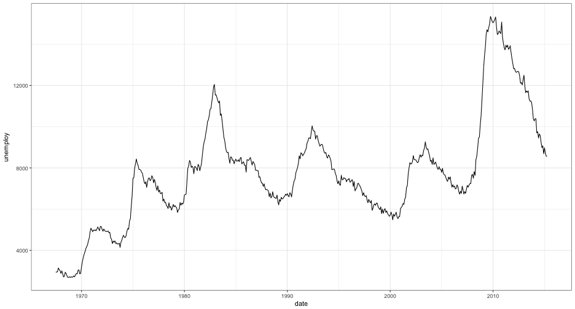

Add a facet to the plot, to view these three distributions by *year*.


```r
base + geom_density(alpha = 0.4) + facet_wrap(~year)
```


----
Group by *year* and facet by *drv*


```r
base2 <- ggplot(mpg, aes(cty, fill = factor(year)))
base2 + geom_density(alpha = 0.4) + facet_wrap(~drv)
```


---- .segue
# Themes (quickly, if there's time)

----
## Overview of themes
* Themes do not change how the data are rendered
* Only change visual properties
* Many built-in themes
	+ Even more available through extension packages (specifically *ggthemes*)
* Fully customizable (though the syntax becomes lengthier)

----
## theme_gray (default)


```r
baseP <- ggplot(economics, aes(date, unemploy)) + geom_line()
baseP + theme_gray()
```


----
## theme_bw


```r
baseP + theme_bw()
```



----
## theme_classic


```r
baseP + theme_classic()
```


----
## theme_dark


```r
baseP + theme_dark()
```


----
## theme_minimal


```r
baseP + theme_minimal()
```


----
## Further customization
* See http://docs.ggplot2.org/dev/vignettes/themes.html
* See *ggplot2* book, Chapter 8

<br>
**Take Home Message:** If you want it to look a certain way, you can do it (essentially nothing is impossible). Often there are others who have developed themes that will be close to what you want, which is easier than developing your own theme (although that can be rewarding in its own right).

